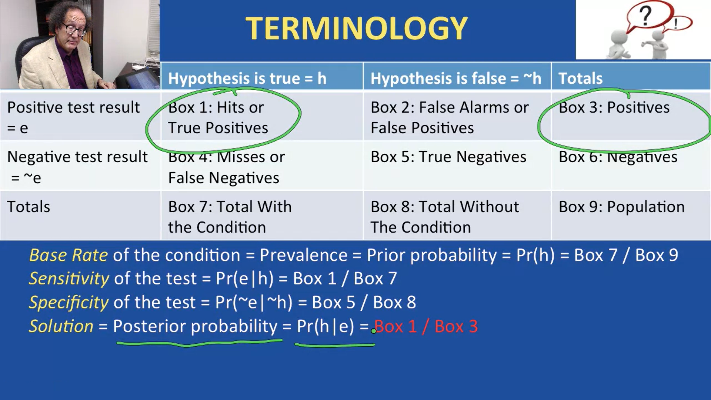
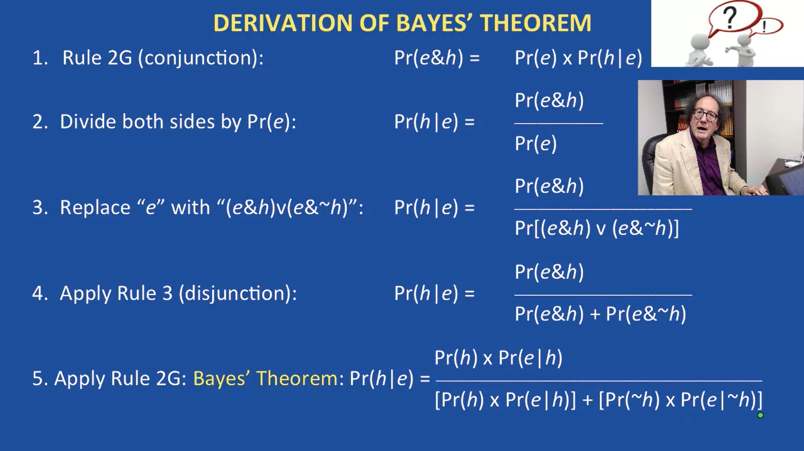

## How to Reason Inductively

### Table of contents
* [1. A New Way to Argue](#1-A-New-Way-to-Argue) 
* [2. Generalizations](#2-Generalizations)
* [3. Explanations and Analogies](#3-Explanations-and-Analogies)
* [4. What Is a Cause?](#4-What-Is-a-Cause?)
* [5. Necessary and Sufficient Conditions](#5-Necessary-and-Sufficient-Conditions)
* [6. Causal Confusions](#6-Causal-Confusions)
* [7. Probability](#7-Probability])

### 1. A New Way to Argue
+ Type of inductive arguments:
	+ Inference to the Best Explanation
	+ Arguments from Analogy
	+ Statistical Generalizations
	+ Statistical Applications
	+ Causal Reasoning
	+ Probability
	+ Decision Making
+ Deductive vs. Induction Standards
	| ***Deductive Standards*** | ***Inductive Standards***  |
	|---------------------------|----------------------------|
	| valid vs. invalid         | strong vs. weak (invalid)  |
	| all or nothing            | degrees (vary in strength) |
	| infefeasible              | defeasible                 |

### 2. Generalizations
+ ***Generalizations*** from ***samples***
	+ ***UNIVERSAL:***
		| ***Universal**                                |
		|-----------------------------------------------|
		| The first F is G.                             |
		| The second F is G.                            |
		| The rest of the Fs ***in the sample*** are G. |
		| >>> ***All*** Fs are G.                       |
	+ ***PARTIAL:***
		| ***Partial**                           |
		|----------------------------------------|
		| The first F is G.                      |
		| The second F is G.                     |
		| The third F is not G.                  |
		| The fourth F is G, and so on.          |
		| >>> X% of Fs ***in the sample are G*** |
		| >>> X% of all Fs are G.                |
	+ Questions to ask about generalizations
		+ 1 - Are the **premises** ***false*** or ***unjustified***?
		+ 2 - Is the **sample** ***too small***?
		+ 3 - Is the **sample** ***biased***?
		+ 4 - Was the **question** ***slanted***?
+ ***Applying generalizations***
	+ ***a*** = the ***individual*** to which the generalization is applied
		| Almost all F are G.          |
		|------------------------------|
		| ***a*** is F.                |
		| >>> ***a*** is (probably) G. |
	+ ***X*** = ***quantifier*** or percentage in generalization
		| ***X***% of F are G.   |
		|------------------------|
		| a is F.                |
		| >>> a is (probably) G. |
	+ Compare generalization and application
		| ***Generalization***   | ***Application***       |
		|------------------------|------------------------|
		| X% of sampled F are G. | X% of F are G.         |
		|                        | a is F.                |
		| >>> X% of F are G.     | >>> a is (probably) G. |
	+ ***Standards*** for ***Applications***
		+ Premises must be true and justified
		+ Percentages should be very high or low
		+ No smaller reference class should conflict

### 3. Explanations and Analogies
+ ***Explanation***
	+ ***Premises***: explain the conclusion
		+ (1) When there is a leak in the roof, water drops through the roof.
		+ (2) When water comes through the roof, it drops onto whatever is in its way.
		+ (3) I am in its way.
	+ ***Conclusion***: describes the phenomenon to be explained
		+ (4) >>> Water drops onto me.
+ Inference to be ***Best Explanation***
	+ (1) Water drops onto me
	+ (2) A leak in the roof would explain why water drops onto me.
	+ (3) No better explanation is available.
	+ (4) >>> There is a leak in the roof.
+ Which explanation is the best?
	+ Process:
		+ 1 - ***Observation***: Nobody else is in the room
		+ 2 - ***Explanation***: The hypothesis that class was cancelled because of a holiday explains the observation
		+ 3 - ***Comparision***: No other hypothesis provides an explanation nearly as good as the holiday hypothesis
		+ 4 - ***Conclusion***: The holiday hypothesis in true.
	+ Other explanations:
		+ The hypothesis that the other students are late is ***falsified*** by the passing of time
		+ The hypothesis that the other students are invisible it not ***conservative***
		+ The hypothesis that the other students are undetectable is not ***fasifiable***
		+ The hypothesis that the other students are playing a joke is not ***deep***
		+ The hypothesis that the professor skipped class is not ***powerful*** or ***broad***
		+ The hypothesis that the other students are at a ceremony is not ***modest***
		+ No other hypothesis seems ***plausible***
		+ >>> No other hypothesis provides an explanation nearly as good as the holiday hypothesis
	+ The holiday hypothesis:
		+ The holiday hypothesis explains why nobody else is there
		+ The holiday hypothesis is ***broad*** because it explains other actual observations ( such as the observation that the whole building is empty)
		+ The holiday hypothesis is ***powerful*** because it applies to many seperate cases (for example, it explains why students won't be there on future holidays)
		+ The holiday hypothesis is ***falsifiable*** because the two students might find out the classes were not cancelled for the holidays
		+ The holiday hypothesis is ***not falsified*** because the two students do not actually find out that classes were not cancelled for the holiday (and for other possible ways to falsify the hypothesis)
		+ The holiday hypothesis is ***conservative*** because it does not conflict with any prior well-established beliefs
		+ The holiday hypothesis is ***deep*** because it does not depend on any assumptions that need but lack independent explanation
		+ >>> The holiday hypothesis, plus accepted facts and principles, gives a strong explanation of why nobody else is in the room
+ Arguments from ***Analogy***
	+ Premises:
		+ Object A has properties P, Q, R, and so on
		+ Objects B, C, D, and so on also have properties P, Q, R, and so on
		+ Objects B, C, D, and so on also have propertiy X
	+ Conclusion:
		+ Object A (probably) also has property X
	+ with:
		+ A = the subject
		+ B, C, and D = the analogous objects
		+ P, Q, and R = the similaries
		+ X = the target
+ ***Standards of Strength***
	+ An argument from analogy is ***stronger*** when
		+ A - Thesimilarities are more important
		+ B - There are more similarities
		+ C - There are fewer disanalogies
		+ D - The analogous objects are more diverse
		+ E - The conclusion is weaker

### 4. What Is a Cause?
+ ***Definitions***
	+ F is a ***SUFFICIENT*** condition for G = ***IN NORMAL CIRCUMSTANCES***
		+ ***For events:*** Whenever an event F happens, an event G also happens
		+ ***For features:*** Anything that has feature F also has feature G
	+ F is a ***NECESSARY*** condition for G = ***IN NORMAL CIRCUMSTANCES***
		+ ***For events:*** Whenever an event F does not happen, an event G also does not happen
		+ ***For features:*** Anything that does not have feature F also does not have feature G
+ ***Kinds of conditions***
	+ ***Conceptual***
		+ Being a whale is ***sufficient*** for being mammal
		+ Being a whale is ***necessary*** for being a sperm whale
	+ ***Causal***
		+ Striking this match is ***sufficient*** for lighting it
		+ Strikiing this match on a rough surface is ***necessary*** for lighting it
	+ ***Moral***
		+ Torturing for fun is ***sufficient*** for doing wrong
		+ Doing something wrong is ***necessary*** for being punishable

### 5. Necessary and Sufficient Conditions
+ ***Negative sufficient condition test***
	+ X is ***NOT*** a ***sufficient*** condition of Y if there is any case where X is ***present*** and Y is ***absent***
+ ***Positive sufficient condition test***
	+ We have a good reason to believe X ***IS*** a ***sufficient*** condition of Y if ***all*** of the following conditions are met
		+ ***1*** - We have not found any case where X is ***present*** and Y is ***absent***
		+ ***2*** - We have tested a wide variety of cases, including cases where X is ***present*** and cases where Y is ***absent***
		+ ***3*** - If there are any other features that are never ***present*** where Y is ***absent***, then we have tested cases where those other features are ***absent*** but X is ***present***
		+ ***4*** - We have tested enough cases of various kinds that are likely to include a case where X is ***present*** and Y is ***absent*** ***IF*** there is any such case
+ ***Negative necessary condition test***
	+ X is ***NOT*** a ***necessary*** condition of Y if there is any case where X is ***absent*** and Y is ***present***
+ ***Positive necessary condition test***
	+ We have a good reason to believe X ***IS*** a ***necessary*** condition of Y if ***all*** of the following conditions are met
		+ ***1*** - We have not found any case where X is ***absent*** and Y is ***present***
		+ ***2*** - We have tested a wide variety of cases, including cases where X is ***absent*** and cases where Y is ***present***
		+ ***3*** - If there are any other features that are never ***absent*** where Y is ***present***, then we have tested cases where those other features are ***present*** but X is ***absent***
		+ ***4*** - We have tested enough cases of various kinds that are likely to include a case where X is ***present*** and Y is ***present*** ***IF*** there is any such case
+ ***Complex conditions***
	+ ***Negative test for sufficient condition***
		+ X is ***NOT*** a ***sufficient*** condition of Y if there is any case where X is ***present*** and Y is ***absent***
	+ ***Negative test for conjuntive sufficient condition***
		+ (W & X) is ***NOT*** a ***sufficient*** condition of Y if there is any case where (W & X) is ***present*** and Y is ***absent***
	+ ***Negative test for necessary condition***
		+ X is ***NOT*** a ***necessary*** condition of Y if there is any case where X is ***absent*** and Y is ***present***
	+ ***Negative test for conjuntive necessary condition***
		+ (W & X) is ***NOT*** a ***necessary*** condition of Y if there is any case where (W & X) is ***absent*** and Y is ***present***
### 6. Causal Confusions
+ ***Correlations***
	+ X and Y are ***positive correlated*** when
		+ 1 - The degree of X increases as the degree of Y increases, and
		+ 2 - The degree of X decreases as the degree of Y decreases
	+ X and Y are ***negative correlated*** when
		+ 1 - The degree of X increases as the degree of Y decreases, and
		+ 2 - The degree of X decreases as the degree of Y increases
+ ***Causal relations***
	+ 1 - A causes B, A => B
	+ 2 - B causes A, B => A
	+ 3 - Some third thing (C) causes both, C => A and C => B
	+ 4 - The correlation is accidental, A B is not related
+ ***Common Causal Fallacies***
	+ 1 - Confusing accidental correlation with causation (***Post hoc ergo propter hoc*** = after this, therefore because of this)
	+ 2 - Confusing cause with effect
### 7. Probability
+ Why probability matter?
	+ Inductive strength can be understood in terms of probability
+ Common mistakes with probability
	+ The Gambler's Fallacy
	+ The Representativeness Heuristic
	+ The Monte Hall Problem
+ Kind of probability
	+ ***Priori*** Probability (assumes likelihoods of alternatives)
	+ ***Statistical*** Probability (based on observed frequencies)
+ ***Rule*** of Probability
	+ ***Negation***
		+ ***Rule 1***: The probability that an event will NOT occur is one minus the probability that itt will occur
		+ ***Symbolically***: Pr(~h) = 1 - Pr(h)
		+ 1 = certainty, so the probabilities of h and ~h must add up to 1 since it is certain that either h or ~h
	+ ***Conjunction***
		+ Two events are ***indepentdent*** if and only if the occurrence of one has no effect on the probability of the other
		+ ***Rule 2***: If ***two events are independent***, the probability of ***both*** events occurring is the ***product*** of the probability of the first event occurring times the probability of the second event occurring
		+ ***Symbolically***: Pr(h & g) = Pr(h) X Pr(g)
	+ ***Conjunction: generalized for any events***
		+ The ***conditional probability*** of X given Y is the percentage of cases where X occurs out of the cases where Y occurs
		+ ***Rule 2G***: The probability of ***both*** of two events occurring is the ***product*** of the probability of the first occurring times ***the conditional probability of the second occurring given that the first occured***
		+ ***Symbolically***: Pr(h & g) = Pr(h) X Pr(g|h)
	+ ***Disjunction***
		+ Two event are ***mutually exclusive*** if and only if they cannot occur together, so Pr(h & g) = 0
		+ ***Rule 3***: If two events are mutually exclusive, then the probability of ***either*** one ***or*** the other occurring is the ***sum** of the probability of the first occurring plus the probability of the second occurring
		+ ***Symbolically***: Pr(h V g) = Pr(h) + Pr(g)
	+ ***Disjunction: generalized for any events***
		+ ***Rule 3G***: The probability of ***either*** one event or another occurring is the ***sum*** of the probability of the first event occurring plus the probability of the second occurring ***minus*** the probability of both events occurring together
		+ ***Symbolically***: Pr(h V g) = Pr(h) + Pr(g) - Pr(h & g)
	+ ***Once in a series***
		+ ***Rule 4***: The probability that an event will occur at least once in a series of independent trials is one minus the probability that it will not occur in that series
		+ ***Symbolically***: 1 - Pr(~h)^n (n = the number of trials)
+ ***Bayes Theorem***
	+ USes of this method
		+ 1 - Other tests for diseases
		+ 2 - Drug tests such as for athletes
		+ 3 - Evidence in legal trials, such as eyewitnesses
		+ 4 - Prediction of future behavior, such as who will commit a crime or fail in school

<kbd></kbd>

<kbd></kbd>

+ ***Three kinds of Decisions or Choices***
	+ Decisions with ***CERTAINTY***
		+ = the chooser knows the actual outcomes of each option or alternative action rather than just the probabilities of the outcomes
	+ Decisions with ***RISK***
		+ = the chooser does ***not*** know the actual outcomes of each option or alternative action but ***does*** know the probabilities of the outcomes
	+ Decisions with ***IGNORANCE*** (or uncertainty)
		+ = the chooser does ***not know*** the actual outcomes of the options or alternative actions and ***also does NOT know*** even the probabilities of those outcomes
+ Overall value
	+ Actual overall value (or utility) of an act = all of the good and bad effects that the act actually has
	+ Expected overall value (or expected utility) of an act = all of the good and bad effects of the act times the probability of each effect

***

  
  
_This note was created by [**ChuongQuoc1413017**](https://github.com/ChuongQuoc1413017/Note/tree/main/Introduction%20to%20Logic%20and%20Critical%20Thinking%20Specialization)@2022_
